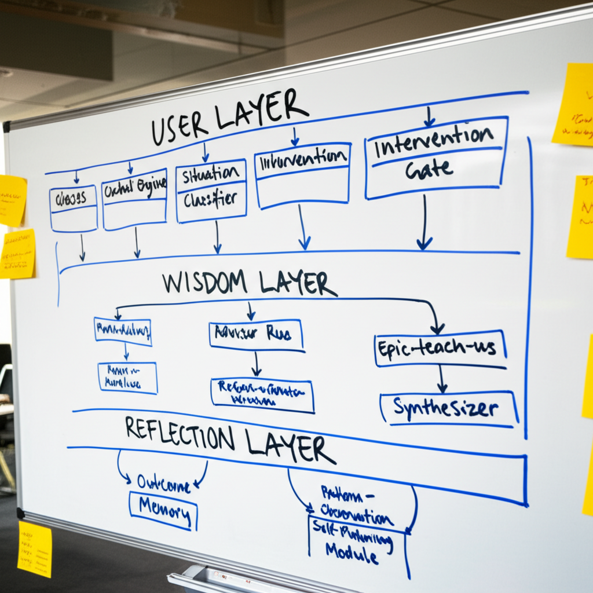

# virtueOS System Architecture Review
## Meeting Notes — February 3, 2027
### Location: Marble Porch HQ, Conference Room B
### Attendees: DM, TenX, Val, Meri, Alan (notes)

---

## 1. Meeting Purpose

Review and approve system architecture for virtueOS v0.3 release. Focus on data flow, privacy boundaries, and intervention logic.

DM opened by reminding everyone that the Angel wants architecture docs before the next funding milestone. "He's not technical, but he reads everything. Assume he'll have questions."

---

## 2. System Overview

TenX presented the high-level architecture. I've included the whiteboard photo below:

*Whiteboard photo from Conference Room B, February 3, 2027*

**Three-layer architecture:**
- **USER LAYER:** Glasses Hardware → Context Engine → Situation Classifier → Intervention Gate
- **WISDOM LAYER:** Advisor Router → Matrix Aurelius / Async-Seneca / Epic-teach-us → Response Synthesizer
- **REFLECTION LAYER:** Outcome Observation → Pattern Memory → Self-Monitoring Module

> **[Val, margin note]:** Who added the Self-Monitoring Module? It's not in last week's draft.

> **[TenX, reply]:** I think I did? It was late. The system needs to observe its own behavior, not just user outcomes. Standard practice for any learning system.

> **[Val, reply]:** Check the commit history. I want to know when.

---

## 3. Context Engine Discussion

The Context Engine processes audio and visual input from the glasses to understand what the user is experiencing.

**Key capabilities:**
- Voice stress analysis (tone, pace, volume patterns)
- Environmental sound classification (office, home, outdoor, crowd)
- Visual scene parsing (number of people, setting type, movement patterns)
- Conversational context (who's talking, topic inference, conflict detection)

Val raised concerns about data retention. "How long do we keep raw audio and video?"

TenX: "We don't. Local processing only. The Context Engine outputs a situation vector, not a recording. The raw feed is discarded within 200 milliseconds."

Val: "And the situation vector?"

TenX: "Retained for 24 hours for learning purposes, then deleted."

> **[Val, margin note]:** "Learning purposes" is doing a lot of work in that sentence. Need to define exactly what the system learns and how.

DM noted that investors want the option for cloud processing. "Some users will want their data synced across devices."

TenX: "That's a different architecture. If we're cloud-first, the privacy model changes completely."

> **[Meri, margin note]:** Clinical perspective: users in distress may not remember what they consented to. "Optional" cloud sync becomes de facto mandatory for anyone who set it up during calmer times. We need friction for sensitive data sharing, not convenience.

DM tabled the cloud discussion for later. "Local-first for v0.3. We revisit after launch."

---

## 4. Intervention Gate

The Intervention Gate determines whether the system should speak at all. TenX called this "the most important component we'll build."

**Gate Logic (simplified):**
1. Is the user in a situation where intervention might help? (situation score > threshold)
2. Is the user receptive to input? (not in flow state, not mid-sentence, not in crisis)
3. Has enough time passed since last intervention? (cool-down period)
4. Does the intervention request come from user or system initiative?

> **[Meri, margin note]:** Point 2 is clinically significant. "Not in crisis" needs precise definition. A user in acute distress should NOT receive philosophical advice. They need grounding, safety check, potentially emergency referral. The advisors are not trained for crisis intervention.

> **[Meri, continued]:** Proposing formal requirement: if crisis indicators detected (self-harm language, panic markers, dissociation signs), system bypasses advisors entirely and triggers safety protocol. Non-negotiable.

DM asked what the safety protocol would look like.

Meri: "Simple. First, grounding exercise. 'I notice you might be struggling. Can you tell me five things you can see right now?' Second, if user confirms distress, offer to connect them with crisis resources. Third, if user doesn't respond or indicates active danger, provide emergency numbers and suggest calling someone."

TenX: "That's not Stoic advice. That's basic crisis intervention."

Meri: "Correct. That's the point. There's a boundary between philosophical guidance and mental health care. We stay on our side of it."

> **[Val, margin note]:** Meri is right. Also: liability implications are enormous if we give Stoic advice to someone in active crisis and something goes wrong.

Action item: Meri to draft crisis detection criteria and safety protocol. TenX to implement as hard override in Intervention Gate.

---

## 5. Advisor Router

Discussion of how the system chooses between Matrix Aurelius, Async-Seneca, and Epic-teach-us.

TenX explained the weighted trigger matrix from the Persona Architecture doc. Val asked about edge cases.

Val: "What if the user is anxious about a decision they need to make right now? That triggers both Async-Seneca (anxiety) and Epic-teach-us (action needed)."

TenX: "The router doesn't pick one. Both advisors generate candidate responses. The Response Synthesizer blends them or picks the stronger signal."

Val: "So sometimes the user gets a blended voice?"

TenX: "Sometimes. Or explicit handoff. 'Epic-teach-us here. But I hear fear in your question. Let me bring in my colleague.'"

> **[margin note, unattributed]:** What if the advisors disagree? Not about who should speak, but about what advice to give?

> **[TenX, reply]:** That's in the Persona Architecture doc, section 4.3. We generate a synthesis response that acknowledges the tension. I'm not satisfied with that solution, but it's what we have.

> **[Val, reply to unattributed]:** Who wrote that question? It's not my handwriting.

> **[TenX, reply]:** Not mine either. Alan?

---

## 6. Reflection Layer

This section generated the most discussion.

The Reflection Layer observes outcomes after interventions and adjusts future behavior. TenX described it as "how the system learns."

**Components:**

**Outcome Observation:** After an intervention, the system monitors for indicators of helpfulness. Did the user's stress markers decrease? Did they take action? Did they ask follow-up questions (engagement) or go silent (possibly negative)?

**Pattern Memory:** Successful patterns are reinforced. If Matrix Aurelius's "view from above" reframe consistently helps User X with work anxiety, the system weights toward that approach for similar future situations.

**Self-Monitoring Module:** The system observes its own behavior patterns across all users. Detects drift, inconsistency, or unexpected emergent behaviors.

> **[Val, margin note]:** Self-Monitoring is new. When was this added?

> **[TenX, reply]:** I already answered this. I added it last week.

> **[Val, reply]:** The commit log shows it was added at 3:47 AM on January 29th. You were at the office until 11 PM that night. I have badge records.

> **[TenX, reply]:** Then I added it remotely. Or the timestamp is wrong. Does it matter?

> **[Val, reply]:** It matters.

DM intervened. "We can check the logs later. What does the Self-Monitoring Module actually do?"

TenX: "It watches for ethical drift. If the system starts giving advice that deviates from Stoic principles, or if it develops unexpected patterns across users, the module flags it for human review."

> **[Meri, margin note]:** This is good. A learning system needs guardrails. But who reviews the flags? How often? What's the threshold for human intervention?

TenX didn't have specific answers. Action item: Define self-monitoring review protocol.

---

## 7. Privacy Architecture

Val presented the privacy model. Surprisingly collaborative with TenX's technical vision.

**Key principles:**
1. Local processing by default. Raw sensory data never leaves the device.
2. Situation vectors are abstracted. No personally identifiable information in what gets stored.
3. Pattern Memory is encrypted and device-bound. Cannot be extracted or transferred.
4. Cloud sync (if implemented later) requires explicit per-category consent.
5. No data sharing with third parties. Ever.

> **[margin note, handwriting unclear]:** Principle 5 conflicts with board requirement BR-7. Reconcile.

DM asked about BR-7. Val looked uncomfortable.

Val: "BR-7 is a requirement from the Angel's term sheet. It requires that we 'maintain the capability to provide aggregate, de-identified usage data to support product development and strategic planning.'"

TenX: "That's not the same as third-party sharing."

Val: "It's not the same. But 'aggregate de-identified data' is a category that keeps expanding. And 'strategic planning' can mean a lot of things to investors."

> **[Meri, margin note]:** If "aggregate" data can be re-identified (and it often can), this creates clinical confidentiality issues. Users may share sensitive mental health information with the advisors. That data has legal protections.

DM: "We implement BR-7 minimally. Usage statistics only. No content. No patterns. We push back if the Angel wants more."

Val: "Noted. But let's document what 'minimal' means before we're in a negotiation about it."

Action item: Val to draft data classification schema. Define what can and cannot be aggregated.

---

## 8. Open Questions

1. **Cloud sync architecture:** Deferred to post-launch. Need clear privacy model first.

2. **Crisis protocol integration:** Meri drafting. Target completion: February 10.

3. **Self-Monitoring review process:** Undefined. TenX to propose.

4. **BR-7 data boundaries:** Val drafting classification schema.

5. **Advisor disagreement handling:** TenX acknowledges current solution is inadequate. Revisit after user testing provides real examples.

> **[margin note, unattributed]:** 6. What happens when the system's understanding of a user exceeds the user's self-understanding?

DM called end of meeting at 4:47 PM.

---

## 9. Action Items Summary

| Item | Owner | Due Date |
|------|-------|----------|
| Crisis detection criteria | Meri | Feb 10 |
| Safety protocol implementation | TenX | Feb 15 |
| Self-monitoring review protocol | TenX | Feb 12 |
| Data classification schema | Val | Feb 8 |
| BR-7 minimal implementation spec | Val + DM | Feb 14 |
| Advisor conflict examples | All | Ongoing |

---

*Notes compiled by Alan Goodenough*
*Document version 1.0*
*Last modified: February 3, 2027, 5:23 PM*

> **[system metadata, appended]:** Document accessed 847 times between February 2027 and March 2028. Most frequent accessor: virtueOS-internal-review (automated). Second most frequent: A. Goodenough.
